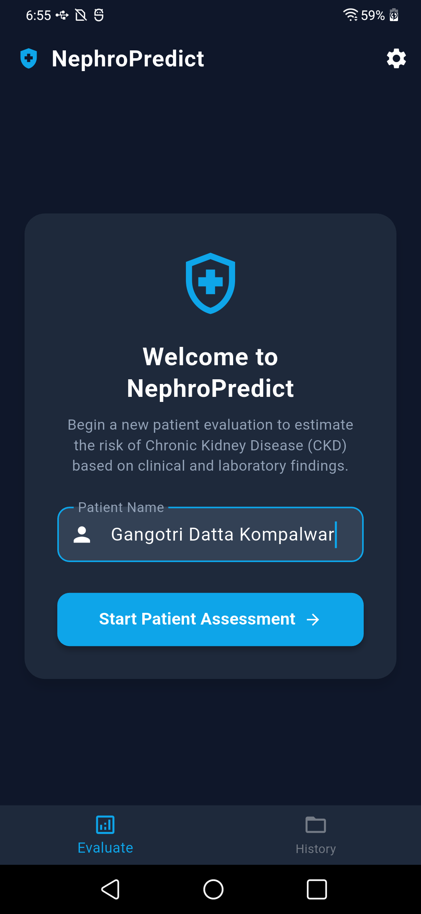
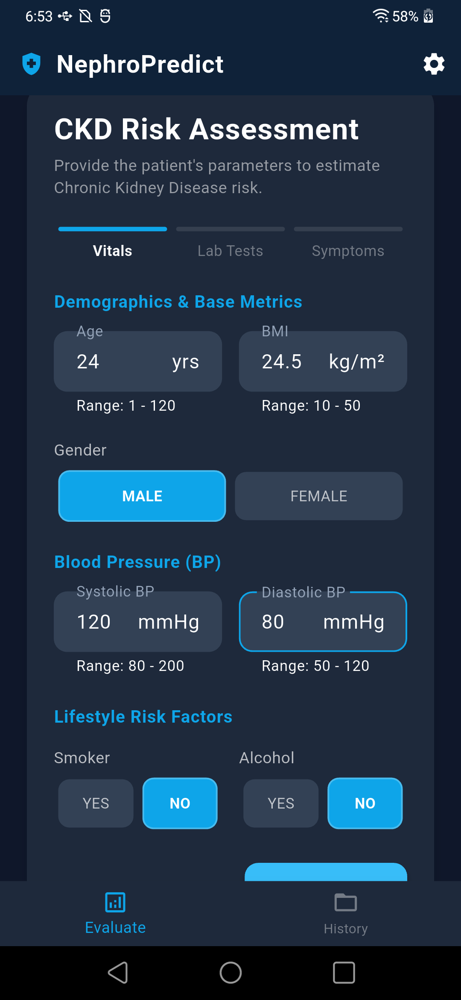
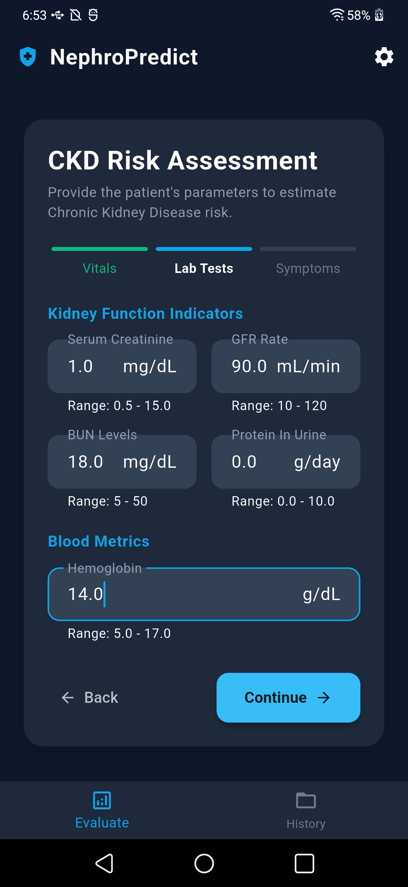
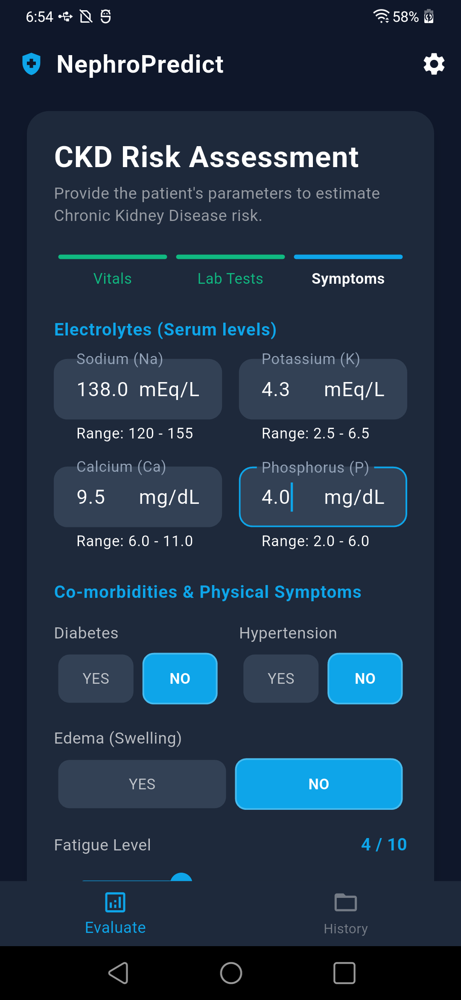
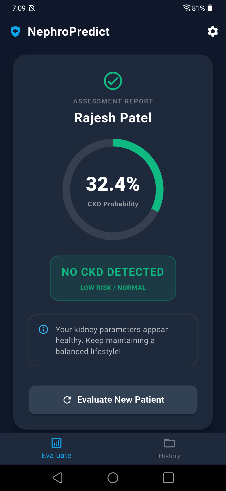
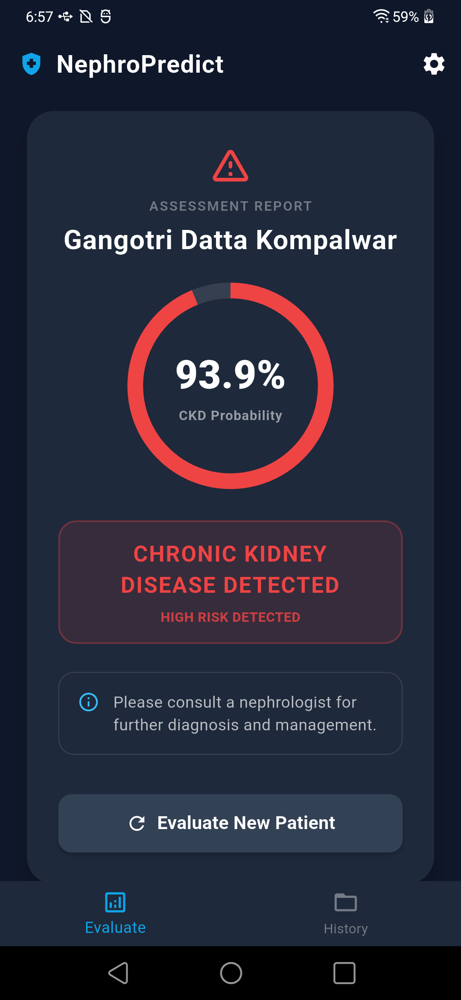
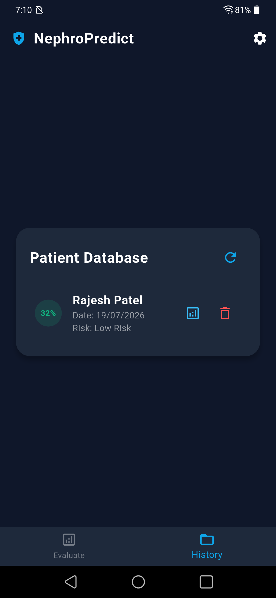
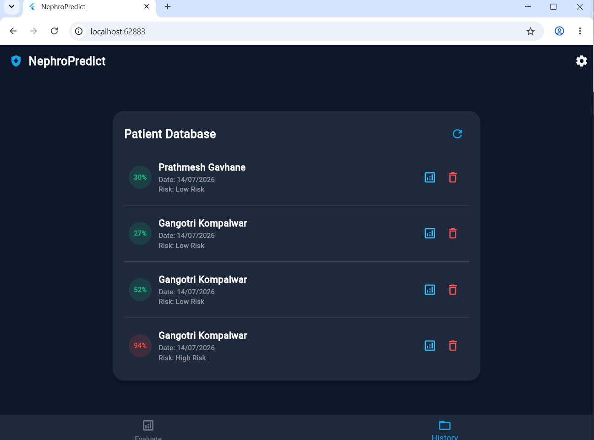
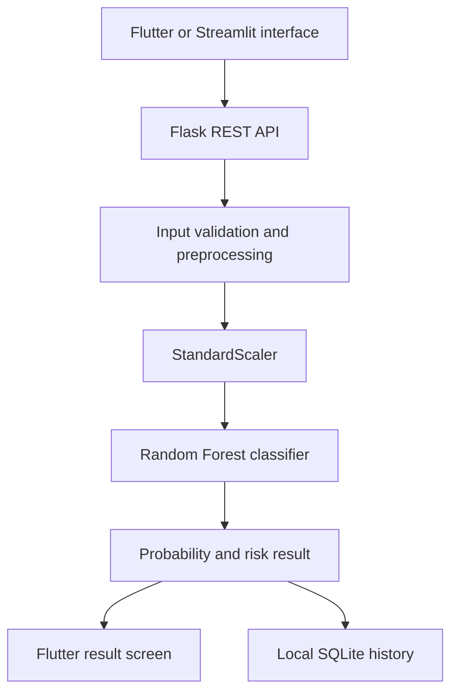

# NephroPredict: Chronic Kidney Disease Risk Assessment

NephroPredict is an end-to-end machine-learning prototype for early Chronic Kidney Disease (CKD) risk assessment. It combines a Random Forest classifier, Flask REST API, Streamlit interface, Flutter application and SQLite-based local prediction history.

> **Medical disclaimer:** NephroPredict is an academic prototype for educational and research purposes. It is not a medical device and must not replace diagnosis or advice from a qualified healthcare professional.

## Key Features

- Random Forest model for binary CKD risk prediction
- Class-imbalance handling with SMOTE during model development
- Multi-step Flutter clinical assessment
- Input validation and clinical reference ranges
- CKD probability and risk-status output
- Flask REST API for mobile integration
- Optional Streamlit prediction interface
- Local SQLite prediction history
- Patient dashboard with detailed assessment reports
- Automated backend and Flutter tests

## Application Screenshots

<table>
  <tr>
    <th>Welcome</th>
    <th>Demographics</th>
    <th>Kidney Function</th>
    <th>Medical History</th>
  </tr>
  <tr>
    <td></td>
    <td></td>
    <td></td>
    <td></td>
  </tr>
  <tr>
    <th>No CKD Result</th>
    <th>CKD Risk Result</th>
    <th>Patient Dashboard</th>
    <th>Patient Database</th>
  </tr>
  <tr>
    <td></td>
    <td></td>
    <td></td>
    <td></td>
  </tr>
</table>

## System Architecture



## Machine-Learning Workflow

1. Load and inspect the CKD dataset.
2. Clean and preprocess numerical and categorical features.
3. Split the data into training and testing sets.
4. Apply SMOTE only to the training data.
5. Standardize model features.
6. Compare multiple classification algorithms.
7. Select the best-performing Random Forest model.
8. Save the trained model, scaler and selected feature list.
9. Serve predictions through Flask and Streamlit interfaces.

## Dataset

The model-development notebook uses `Chronic_Kidney_Disease_data.csv`.

- **Records:** 1,659
- **Original columns:** 54
- **Target:** `Diagnosis`
- **Task:** Binary classification
- **Class-imbalance strategy:** SMOTE applied only to the training data

The dataset includes demographic, lifestyle, medical-history, vital-sign, laboratory and symptom-related attributes.

## Model Comparison

| Model | Cross-Validation Score | Test Accuracy |
|---|---:|---:|
| Logistic Regression | 83.92% | 77.41% |
| Decision Tree | 86.71% | 73.19% |
| Random Forest | 97.46% | 90.96% |

Random Forest was selected as the final model based on its evaluation performance.

Reported results apply only to the project dataset and evaluation procedure. They do not establish clinical effectiveness.

## Selected Model Features

The deployed model uses nine selected features:

- Physical Activity
- Urinary Tract Infections
- Fasting Blood Sugar
- Serum Creatinine
- Glomerular Filtration Rate
- Protein in Urine
- HDL Cholesterol
- NSAID Use
- Edema

## Technology Stack

| Component | Technologies |
|---|---|
| Mobile application | Flutter, Dart, Material Design |
| REST API | Python, Flask, Flask-CORS |
| Alternative interface | Streamlit |
| Machine learning | scikit-learn, Random Forest |
| Data processing | Pandas, NumPy |
| Class balancing | imbalanced-learn, SMOTE |
| Model persistence | Joblib |
| Local storage | SQLite |
| Analysis | Jupyter Notebook, Matplotlib, Seaborn |
| Testing | pytest, Flutter Test |

## Project Structure

```text
nephropredict-ckd-detection/
├── .github/
│   └── workflows/
├── app/
│   ├── lib/
│   │   └── main.dart
│   ├── test/
│   ├── android/
│   ├── ios/
│   ├── web/
│   ├── windows/
│   └── pubspec.yaml
├── backend/
│   ├── api.py
│   ├── app.py
│   ├── Chronic_Kidney_Disease_data.csv
│   ├── Nephropredict.ipynb
│   ├── nephropredict_best_model.pkl
│   ├── nephropredict_feature_list.pkl
│   ├── nephropredict_label_encoders.pkl
│   └── nephropredict_scaler.pkl
├── screenshots/
├── tests/
│   └── test_api.py
├── .gitignore
├── requirements.txt
├── requirements-dev.txt
└── README.md
```

## Prerequisites

- Python 3.10 or 3.11 recommended
- Flutter SDK 3.x
- Android Studio, emulator, Chrome or a physical mobile device
- Git

The saved model was created with `scikit-learn==1.6.1`, which is pinned in `requirements.txt`.

## Backend Setup

Run these commands from the repository root:

```powershell
py -3.11 -m venv .venv
.\.venv\Scripts\Activate.ps1
python -m pip install --upgrade pip
pip install -r requirements.txt
python backend/api.py
```

The API starts at `http://127.0.0.1:5000`.
## Streamlit Interface

After installing the Python requirements:

```powershell
streamlit run backend/app.py
```
## Flutter Application

Open another terminal from the repository root:

```powershell
cd app
flutter pub get
flutter run
```
## Backend Address

Configure the server address from the application settings:

- **Android emulator:** `http://10.0.2.2:5000`
- **Web or local desktop:** `http://localhost:5000`
- **Physical device:** `http://<computer-local-IP>:5000`

The phone and computer must be connected to the same local network when using a physical device.
## API Endpoints

| Method | Endpoint | Purpose |
|---|---|---|
| GET | `/` | Check API status |
| POST | `/predict` | Generate a CKD risk prediction |
| GET | `/history` | Retrieve local assessment history |
| DELETE | `/history/<record_id>` | Delete a history record |

## Example Prediction Request

```json
{
  "PatientName": "Demo Patient",
  "Age": 45,
  "Gender": "Male",
  "BMI": 24.5,
  "SystolicBP": 120,
  "DiastolicBP": 80,
  "SerumCreatinine": 1.0,
  "BUNLevels": 18.0,
  "GFR": 90.0,
  "ProteinInUrine": 0.0,
  "Diabetes": "no",
  "Hypertension": "no",
  "Edema": "no",
  "FatigueLevels": 4
}
```

## Example Response

```json
{
  "success": true,
  "probability": 0.32,
  "prediction": 0,
  "prediction_text": "No CKD Detected",
  "advice": "Your kidney parameters appear healthy. Keep maintaining a balanced lifestyle!"
}
```

## Testing

Validate the Python source and run the backend tests:

```powershell
py -m compileall backend
py -m pytest tests -v
```

Run the Flutter tests:

```powershell
cd app
flutter test
```
## Building the Android APK

From the Flutter application folder:

```powershell
cd app
flutter build apk --release
```

The generated APK will be available at `app/build/app/outputs/flutter-apk/app-release.apk`.
## Privacy and Security Notes

- The SQLite database is excluded from Git.
- Local assessment history should not be committed.
- Public demonstrations should use synthetic or authorized test data.
- Prediction-history endpoints are intended for local prototype use and do not implement production authentication.
- Production healthcare deployment would require authentication, encryption, access control, consent management, audit logging and formal clinical validation.
## Repository Data Policy

The following generated or local files are intentionally excluded:

- SQLite prediction-history databases
- Python virtual environments and cache files
- Flutter build output
- IDE-specific configuration
- Local environment files
- Test and coverage caches

The dataset, notebook and trained model artifacts are included to support reproducibility of the academic project.
## Author

**Gangotri Kompalwar**

- GitHub: [kompalwargangotri](https://github.com/kompalwargangotri)
- LinkedIn: [Gangotri Kompalwar](https://www.linkedin.com/in/gangotri-kompalwar-4635b9359)
